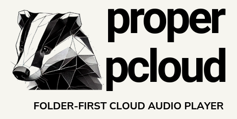

<p align="center">
  
</p>

# properpcloud

Folder-first pCloud audio playback for Android and Linux.

[](CHANGELOG.md)
[](LICENSE)
[](https://properpcloud.fkr.dev)

Audio libraries are often organized correctly in folders while their embedded tags are incomplete, inconsistent, or absent. properpcloud keeps the provider folder tree visible, builds deterministic queues from stable file identities, and resolves temporary stream links only when playback needs them.

> Independent software. Not affiliated with or endorsed by pCloud AG.

## Clients

| Platform | UI | Playback | Persistence | Credentials |
| --- | --- | --- | --- | --- |
| Android | Jetpack Compose / Material 3 | Media3 service | DataStore | Android encrypted storage |
| Linux | Compose Desktop | mpv JSON IPC | SQLite / XDG | freedesktop Secret Service |

Both clients share the same Kotlin/JVM source, folder, sorting, queue, progress, resume, inspection, pCloud, WebDAV, and metadata contracts.

## Capabilities

- stable-ID folder navigation with filename context and breadcrumbs;
- natural filename, disc/track, tagged-title, and modification-time sorting;
- play-now, play-next, append, direct-folder, and recursive-subtree queue operations;
- deterministic duplicate collapse, cancellation, and explicit partial-result reporting;
- queue reordering, removal, persistence, restoration, and containing-folder navigation;
- smart long-form resume and completion policy;
- just-in-time pCloud direct-link resolution without persistent signed URLs;
- a bounded direct pCloud sign-in fallback with explicit Europe/United States region choice;
- browser OAuth support when a registered public application ID is available;
- raw provider and metadata inspection with secrets redacted;
- staged, hash-guarded metadata export and repair planning;
- deterministic generated-WAV demo media requiring no account or network;
- Linux MPRIS media keys, Secret Service tokens, SQLite state, and XDG paths;
- a pre-rendered Markdown documentation site deployed through GitHub Pages.

## First run

### Linux

```bash
make desktop-test
make desktop-smoke
make desktop-run
```

The smoke test generates audio, recursively assembles a queue, persists SQLite state, controls a real host mpv process through a private Unix socket, and uses null audio output.

Runtime dependencies on Arch Linux:

```bash
sudo pacman -S --needed mpv libsecret
```

### Android

```bash
make doctor
make test
make lint
make build
make install
```

Start with **Demo library** on either platform. Connect pCloud only after demo browsing, queuing, playback, seeking, and restart restoration work locally.

Detailed instructions are published at `https://properpcloud.fkr.dev` and remain available as Markdown under [`docs/`](docs/index.md).

## Security model

```yaml
identity:
  media: [source_id, stable_node_id]
  signed_URL_as_identity: forbidden
credentials:
  OAuth_password_handling: provider_only
  direct_login_password:
    destination: selected_pCloud_regional_API_over_HTTPS
    persisted: never
    logged: never
  Android_session: encrypted_application_storage
  Linux_session: freedesktop_Secret_Service
network:
  cleartext: disabled
  allowed_pCloud_hosts:
    - api.pcloud.com
    - eapi.pcloud.com
playback:
  stream_URL_resolution: immediately_before_load
  persistent_playlist_URLs: forbidden
  Linux_mpv:
    shell: never
    user_config: ignored_with_no_config
telemetry:
  analytics: none
  advertising: none
backend:
  mandatory_service: false
```

See [`SECURITY.md`](SECURITY.md), [`docs/privacy.md`](docs/privacy.md), and [`THIRD_PARTY_NOTICES.md`](THIRD_PARTY_NOTICES.md).

## Build and verification

The pinned container supplies Eclipse Temurin 21, Gradle 9.6.1, Android compile SDK 37, target SDK 36, and build tools 37.0.0. Portable modules emit JVM 17-compatible bytecode.

```bash
make image                # build the pinned toolchain image
make doctor               # validate wrapper, image, and prerequisites
make release-check        # validate specifications and release metadata
make test                 # Android and portable JVM tests
make desktop-test         # Linux adapter tests
make desktop-smoke        # real host mpv + SQLite smoke
make lint                 # Android lint
make build                # Android debug APK
make desktop-package      # desktop application image / package inputs
make linux-ci             # complete host Linux package + mpv + MPRIS gate
make docs-build           # Astro/Starlight static documentation
make ci                   # containerized merge gate, including desktop package image
```

Live pCloud account validation remains protected because public CI contains no provider credentials. Deterministic fixtures cover provider mapping, queue semantics, persistence, metadata staging, and playback adapters without exposing private media.

## Repository structure

```text
properpcloud/
├── app/                    Android UI, encrypted session, DataStore, Media3
├── desktop-app/            Compose Desktop, mpv, SQLite, Secret Service, MPRIS
├── core-model/             source-neutral identity, queue, progress, sorting
├── source-pcloud/          portable official pCloud Java-core adapter
├── source-webdav/          portable interoperability boundary
├── metadata-tags/          staged tag inspection and mutation adapter
├── metadata-online/        MusicBrainz and acoustic lookup boundaries
├── docs/                   canonical user, developer, API, policy Markdown
├── website/                Astro Starlight static renderer
├── spec/                   normative YAML contracts and release definitions
├── scripts/                verified builds, release checks, documentation sync
├── .github/workflows/      Android, Pages, and tagged release automation
├── Dockerfile
├── Makefile
├── VERSION
└── CHANGELOG.md
```

## Stable contracts

- [`spec/manifest.yml`](spec/manifest.yml) — normative index and invariants
- [`spec/product.yml`](spec/product.yml) — release feature sets and quality attributes
- [`spec/architecture.yml`](spec/architecture.yml) — layers, data flows, and trust boundaries
- [`spec/contracts.yml`](spec/contracts.yml) — ports, records, persistence, events, and errors
- [`spec/testing.yml`](spec/testing.yml) — fixtures, fault injection, and release gates
- [`spec/linux-client.yml`](spec/linux-client.yml) — native Linux architecture and acceptance
- [`docs/api/`](docs/api/README.md) — human-readable public contract reference

## Release line

| Version | Contract |
| --- | --- |
| `0.0.1` | Verified architecture and build bootstrap |
| `0.1.x` | Validated Android folder-first client |
| `0.2.x` | Native Linux desktop parity and packaging |
| `1.0.0` | Stable cross-platform contracts and migrations |

`VERSION` is canonical. Published tags are immutable. See [`docs/versioning.md`](docs/versioning.md) and [`CHANGELOG.md`](CHANGELOG.md).

## Licensing

Original code is MIT-licensed. Dependencies retain their licenses, including Apache-2.0 components and the LGPL-2.1-or-later jaudiotagger adapter listed in [`THIRD_PARTY_NOTICES.md`](THIRD_PARTY_NOTICES.md). Redistributed notices are included with release artifacts.
